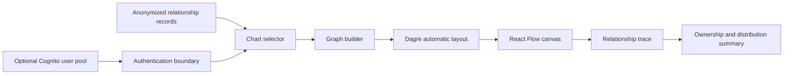

# Entity Visualization


Entity Visualization is a professional organization-chart application I built
while working as a Solutions Engineer at Bitwise Industries / Stria. It turns
ownership data into an interactive, automatically laid-out graph with
relationship tracing, ownership and distribution summaries, document links,
chart selection, minimap navigation, and print output.

The public repository contains anonymized demonstration data. Environment-
specific Cognito identifiers and document URLs are intentionally excluded.

## What it solves

- Converts flat parent/subsidiary records into an interactive ownership graph.
- Automatically lays out complex structures with Dagre instead of requiring
  manually positioned nodes.
- Traces a selected entity through its incoming ownership relationships.
- Keeps chart selection, ownership and distribution summaries, minimap
  navigation, connected-record access, and print output in one workspace.

The anonymized demo exercises **142 relationships across 10 charts and 73
entities**. These are technical-scale figures from the included dataset, not
claims about the former client environment.

## Architecture



## Professional implementation and public edition

| Area | Professional implementation | Public edition |
| --- | --- | --- |
| Entity data | Environment-specific ownership records | Generated, anonymized demonstration records |
| Authentication | Amazon Cognito configuration | Same integration boundary; configuration supplied locally |
| Connected records | Environment-specific document links | UI behavior retained; links intentionally blank |
| Infrastructure | Client-controlled storage and delivery | Excluded; this repository does not deploy or claim control of that environment |
| Product logic | Graph construction, layout, tracing, summaries, navigation, and print | Retained and reviewable |

## Stack

- React 17 and React Flow
- Dagre graph layout
- Amazon Cognito authentication
- Chart.js ownership summaries
- Vite build tooling

## Run locally

```bash
npm ci
npm start
```

With no environment variables, the application opens directly in demo mode
using the anonymized local dataset. To enable authentication, copy
`.env.example` to `.env.local` and supply a Cognito user-pool ID and app
client ID:

```text
VITE_COGNITO_USER_POOL_ID=...
VITE_COGNITO_CLIENT_ID=...
```

These browser identifiers are configuration rather than secrets, but keeping
them outside source prevents a portfolio build from depending on a specific
professional environment.

## Verification

```bash
npm run audit
npm test
npm run build
```

GitHub Actions runs the same security, test, and production-build checks on
every push and pull request.

## Source-use terms

This is reviewable portfolio source rather than an open-source package.
[`NOTICE.md`](NOTICE.md) states the usage terms explicitly; no license is
granted to copy, redistribute, or create derivative works. Production data,
credentials, deployment configuration, and legacy history are intentionally
outside the public repository.
